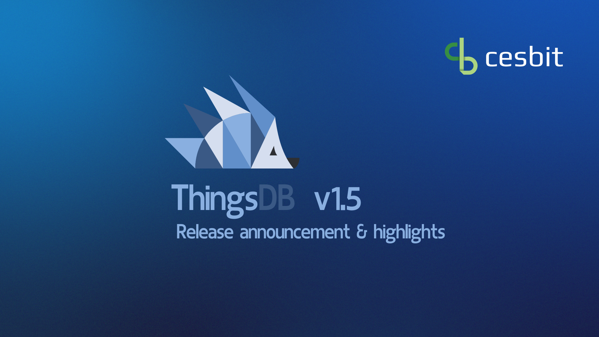

# ThingsDB 1.5: Unleashing Enhanced Capabilities\!

We are thrilled to announce the release of ThingsDB 1.5, bringing a plethora of exciting improvements and powerful new features to your data management experience.

## Enhanced Syntax and Structure:

* **Comments Everywhere:** Embed comments directly within your code for improved readability and maintainability.  
* **Stricter Syntax:** Enforced semicolon usage and stricter syntax checking ensure code clarity and consistency.  
* **Collection Management:** Collection IDs and root IDs can now differ, offering greater flexibility.  
* **Full Collection Exports:** Utilize the `dump` option in `export(..)` for comprehensive collection backups.  
* **Import Functionality:** Effortlessly restore collections using the new `import()` function.  
* **Collection Root Access:** The `root()` function provides direct access to the collection root.

## Improved Functionality:

* **Bug Fixes:** Resolved issues related to enumerators, relation application, async future errors, nesting tasks, and task ownership.  
* **Docker Image Updates:** Both test and build images have been upgraded for enhanced performance and compatibility.  
* **Mathematical Powerhouse:** Embrace a range of new mathematical functions like `abs()`, `cos()`, `log10()`, and more, along with constants like `MATH_E` and `MATH_PI`.  
* **Library Integration:** `libcleri` is now seamlessly integrated, eliminating the need for separate installation.  
* **Time Precision:** `new_backup()` and `new_token()` now exclusively accept timestamps for accurate time management.

## Expanded Capabilities:

* **Set Operators:** Leverage new operators like `<=`, `<`, `>=`, and `>` to perform comprehensive set comparisons.  
* **UTF-8 Enhancements:** Define UTF-8 type properties with improved range support using `<..>`.  
* **Bitwise Operations:** Perform bitwise operations using the NOT (`~`), Left Shift (`<<`), and Right Shift (`>>`) operators.  
* **Task Completion:** Repeating tasks now return `nil` upon successful completion.  
* **Error Correction:** A spelling error in the integer range error message has been rectified.  
* **Relation Enhancements:** Enforced restrictions for relations between non-stored sets and values.  
* **Future Closures:** The maximum number of future closure calls has been increased from 8 to 255\.

## Additional Refinements:

* **Consistent Return Values:** `mod_procedure(..)` now returns `nil` on success for consistency.  
* **Module Methods:** The `argmap` property is now mandatory for exposed module methods.  
* **Duplicate Node Prevention:** Adding nodes will now be checked based on the address and port, preventing duplicates.  
* **Efficient Shutdowns:** Uninitialized nodes no longer experience shutdown wait time.  
* **Improved User Experience:** New users and collections return their names instead of IDs, and empty collections are ignored during restore.  
* **Increased Limits:** The range function maximum has been expanded from 9999 to 100000\.

We are confident that ThingsDB 1.5 empowers you with unprecedented control and flexibility over your data. Dive into the comprehensive release notes for an in-depth exploration of all the enhancements. We invite you to experience the power of ThingsDB 1.5 and unleash the full potential of your data management endeavors\!

Book your introduction demo here or start exploring our playground

And don’t forget to subscribe to our newsletter to be the first to know when our upcoming book of ThingsDB is released\!