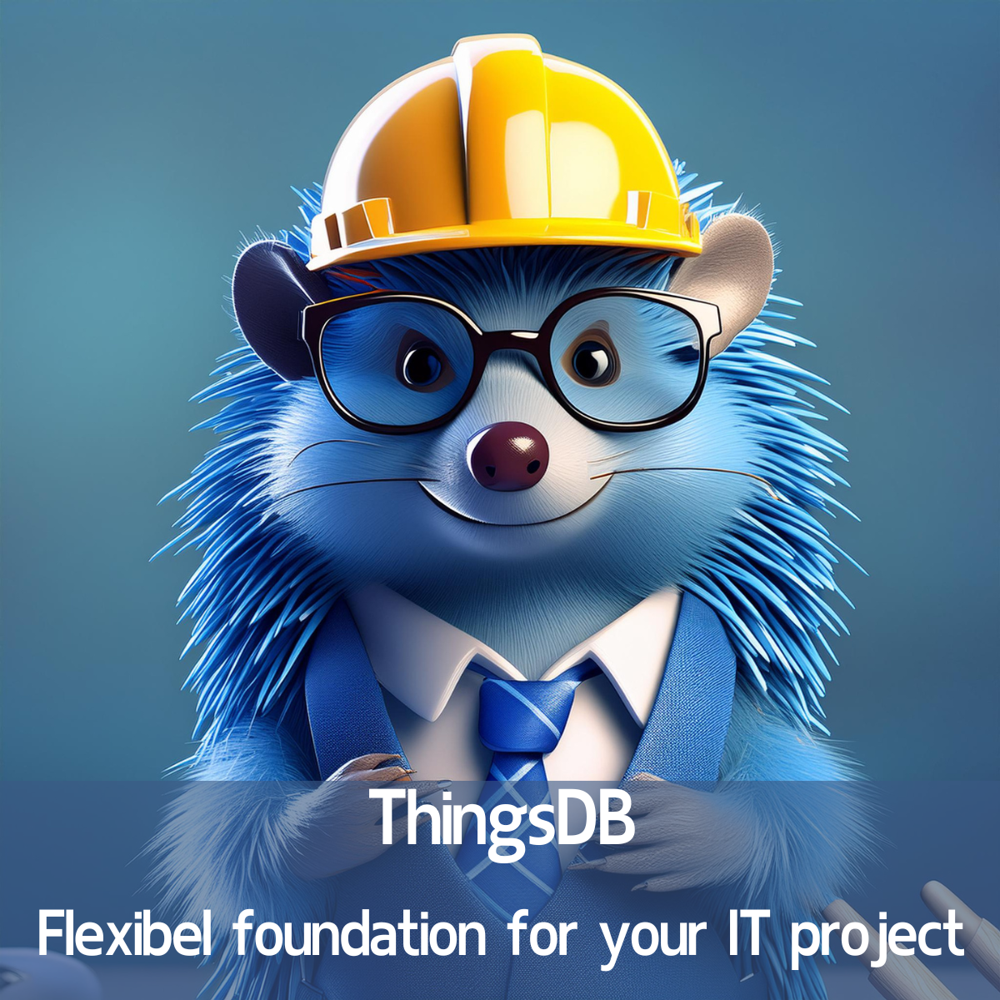

# Flexible foundation for your IT project

## **What's up with that Hedgehog?**

This question was asked to me by a friend without an IT background.

It's a complex question because ThingsDB solves many deeply technical problems that occur in scalable software projects.

You can view ThingsDB as the foundation of a building, a crucial aspect that you rarely see, but that is enormously determining for the building. You can't build a skyscraper on the foundation of a house. With software, we often want to build a skyscraper, but we don't immediately have the resources for it. We then start with a house and remodel it along the way, and sometimes we even tear it down completely to almost start over. Remaking the foundation is often very costly and invisible.

With ThingsDB we do this differently. We have researched how we could make a flexible foundation. Simply put, a foundation that adapts to what you are building. In the construction analogy, the foundation of the house adapts at the moment we build a flat on it, and even a skyscraper.

And we succeeded\!

ThingsDB is essentially a foundation on which you can build almost any software solution and that has all the properties to adapt to the growing need without having to change the entire foundation. This ensures that the development trajectories keep moving because the focus can remain on building the "living space".

Finally, ThingsDB also takes care of the communication between all software components. To use the construction analogy again: The utilities also adapt dynamically.

So if you really want to keep a grip on building a new software solution, or want to adapt an existing solution, consider a dynamic foundation and save on costly redevelopment as your application grows.