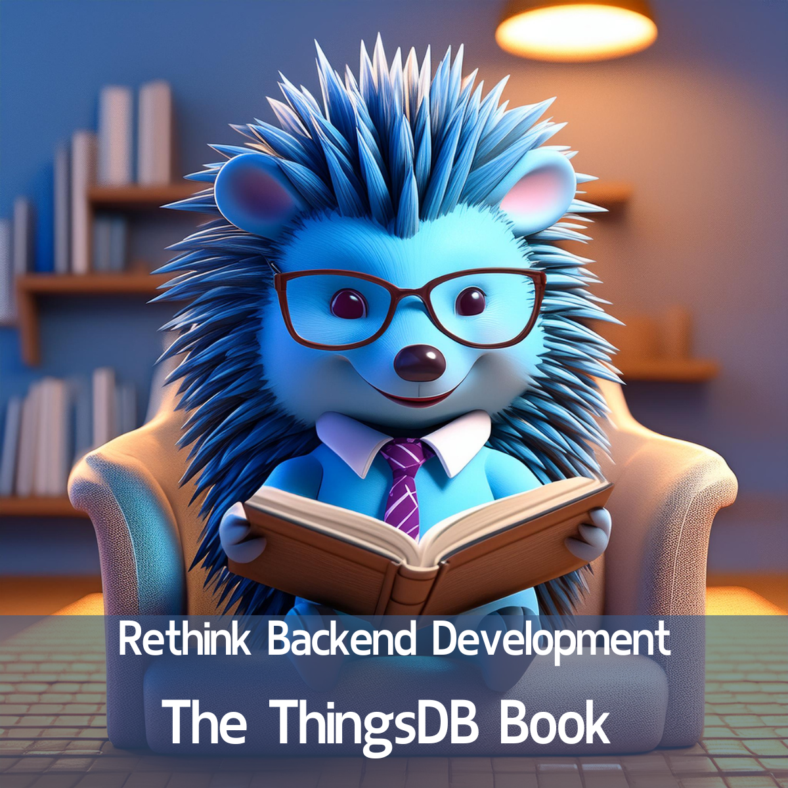

# Rethink Backend Development - The ThingsDB book

Our highly anticipated book, The ThingsDB Book, is finally here and free for everyone\!

Thanks to Jeroen van der Heijden's expertise, this book will completely transform your approach to backend development.

Get your free copy now and start building scalable backends faster\! [https://thingsdb.io/docs](https://thingsdb.io/docs)

We'd love 💙 to hear your feedback\!

## **Repost via Rik privé**

Vergeet de regenachtige zomer\! Duik in de boeiende wereld van backend software ontwikkeling met ons nieuwe boek.

Dit boek is perfect voor iedereen die:

Geïnteresseerd is in het ontwikkelen van efficiënte en schaalbare software oplossingen. Een nieuwe frisse kijk wil op backend software ontwikkeling. Op zoek is naar praktische handvatten om hun vaardigheden naar een hoger niveau te tillen.