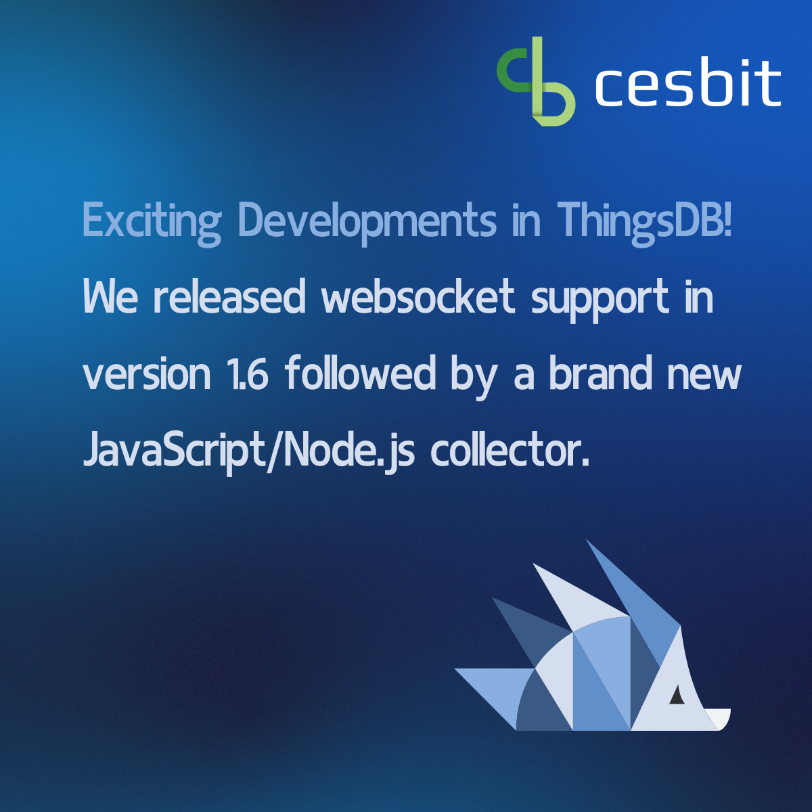

# The ThingsDB community has been buzzing with activity

The ThingsDB community has been buzzing with activity these past few weeks! Just two weeks ago,

[Michal Štefaňák](https://www.linkedin.com/in/ACoAABJsuWcBNyJL1tuXWyD5OgfhB32qng62WI0)

delighted us with a custom PHP connector.

In parallel, our team focused on adding WebSocket support, which we rolled out last Thursday.

Today, thanks to that WebSocket functionality, Michal returns with another fantastic contribution: a JavaScript/Node.js collector for ThingsDB\! This is the true spirit of open-source: teams working together seamlessly across borders to build the best possible solution for everyone.

Interested in learning more about ThingsDB or contributing yourself?

Contact us:

[https://lnkd.in/ew4PQiyH](https://lnkd.in/ew4PQiyH)