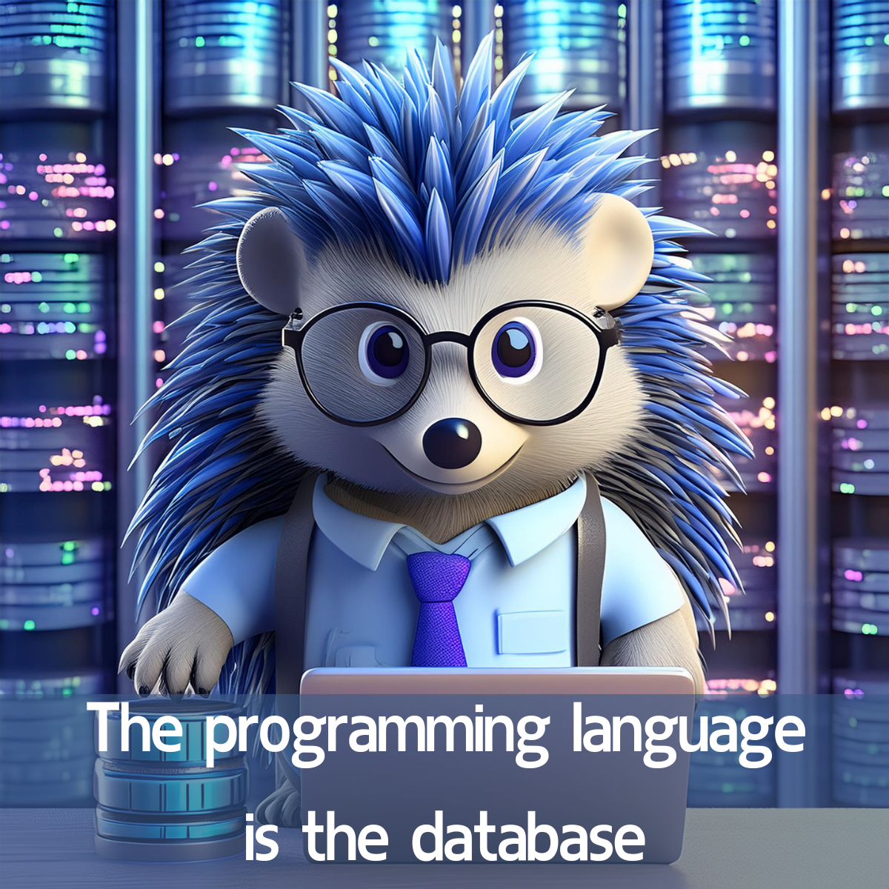

# The programming language is the database

ThingsDB is a game-changer for backend development. It's an all-in-one solution that combines an intuitive object-oriented database with a built-in programming language. This eliminates the need to manage separate database and application layers, streamlining development.

**Key Features:**

* **Unified Environment:** Write and execute code directly within ThingsDB, using its familiar programming language.  
* **Reduced complexity:** No more complex SQL statements, just write code and get the data exactly the way you want  
* **High Availability:** The distributed system architecture ensures your application stays up and running, even if individual nodes experience problems.  
* **Real-time Reactivity:** Event-driven features empower you to build highly responsive applications that react to data changes in real-time.  
* **Open-source and Powerful:** Built on a robust open-source core written in C, ThingsDB offers the flexibility and power developers crave.  
* **Stored-State-Distributed-Interpreter (SSDI):** This technical term signifies that ThingsDB can distribute and execute code across its network while maintaining application state, ensuring smooth operation.