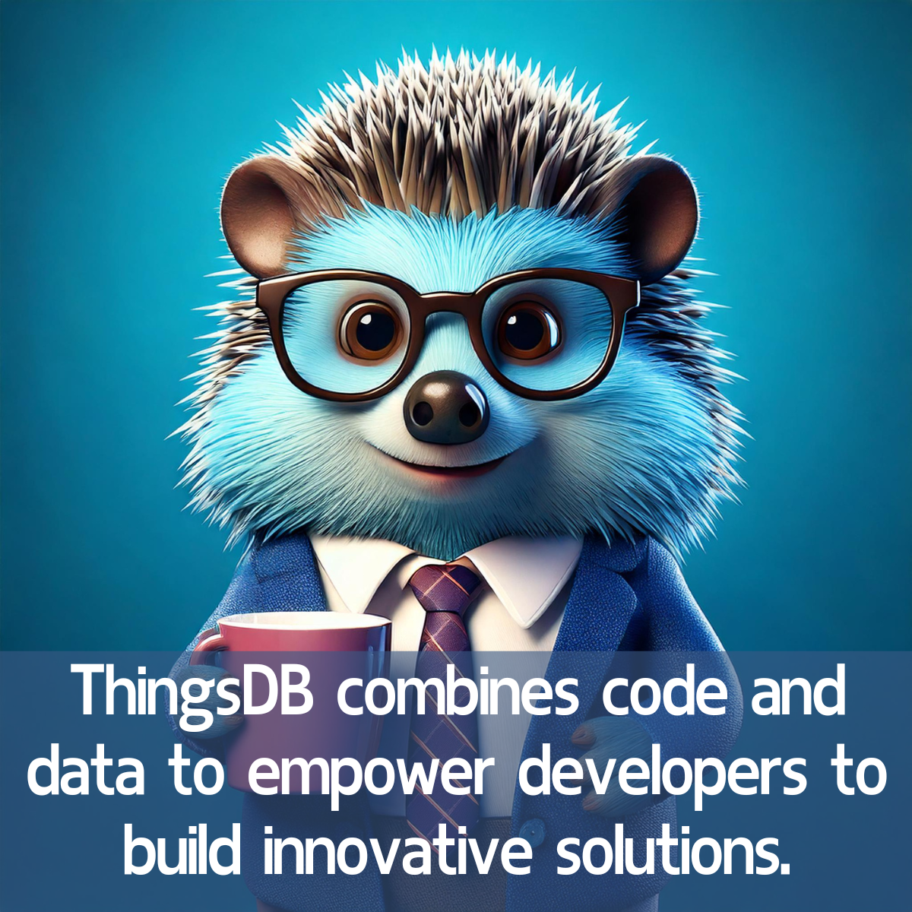

# ThingsDB combines code and data to empower developers to build innovative solutions

ThingsDB is an open-source Stored-State-Distributed-Interpreter (SSDI) solution written in C that offers a powerful and intuitive approach to data management. It provides a unique way to combine code and data, allowing developers to build flexible, secure, and scalable applications.

Here's what makes ThingsDB a compelling choice for developers:

- Robustness and High Availability: The interpreter's state is consistently synchronized across all nodes, ensuring data integrity and high availability, even if some nodes fail.  
- Simplified Development: ThingsDB offers a simple, intuitive language that makes developing applications easier. Its syntax and structure are similar to languages like JavaScript and Python, making it accessible to developers familiar with those paradigms.  
- Versatility: ThingsDB is not just a database; it can also replace message-broker solutions, which simplifies application architecture. It can be applied in a diverse range of applications and inspire novel and innovative solutions.  
- Real-time capabilities: ThingsDB includes built in event-driven programming, allowing for real time data updates.  
- Performance and Efficiency: ThingsDB is optimized for speed, ensuring fast data processing and retrieval.  
- Cost-Effectiveness: As an open-source solution, ThingsDB eliminates licensing costs.  
- State Persistence: Unlike traditional programming languages, ThingsDB maintains state persistence, ensuring uninterrupted data access and manipulation.  
- Extensibility: ThingsDB can be extended with modules, allowing integration with external resources and platforms.

ThingsDB offers capabilities such as:

- Defining custom functions (procedures) to execute complex logic within the database.  
- Specifying data structures (types) to represent your data accurately and efficiently.  
- Triggering actions based on data changes (events) and keep applications informed.  
- Scheduling background jobs (tasks) to perform asynchronous operations.

ThingsDB's architecture is adaptable, allowing it to fit seamlessly into various application scenarios. It utilizes an interpreter, similar to Python or Java, but with the added benefit of state persistence. This means that data is not lost when the interpreter is terminated. Furthermore, ThingsDB is built to run across multiple nodes for high availability and scalability, allowing for seamless garbage collection without blocking.

ThingsDB is more than just a database, it is a powerful tool that empowers developers to build innovative solutions by combining code and data.