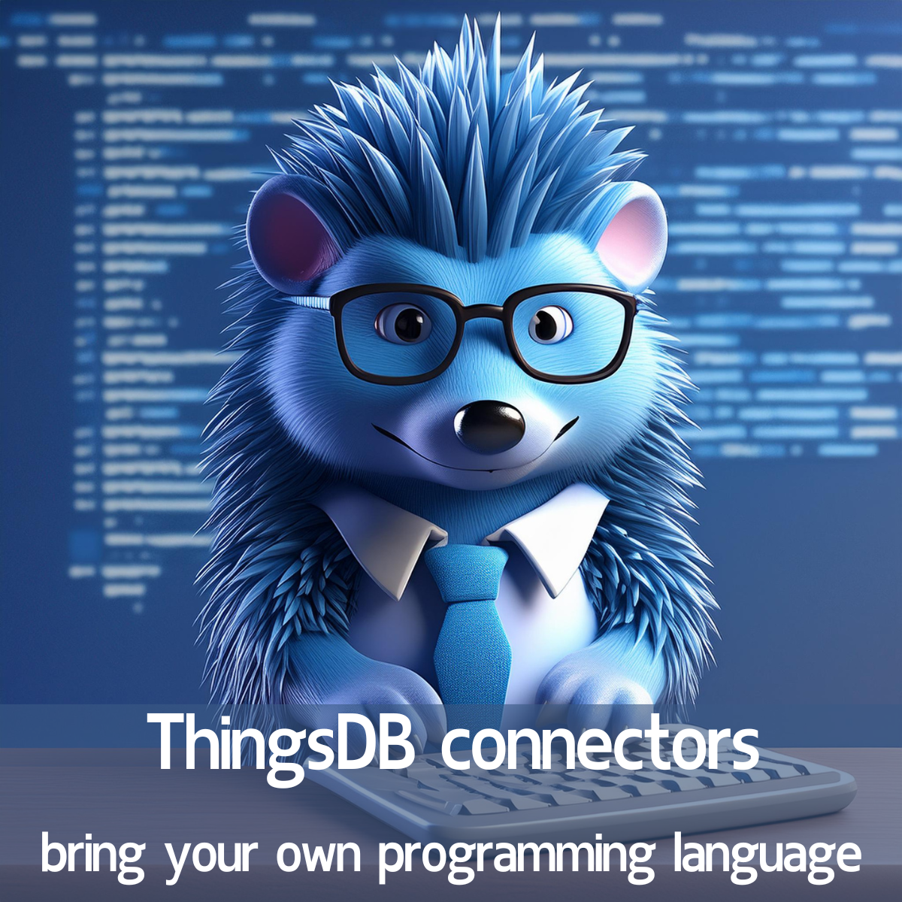

# ThingsDB connectors

With ThingsDB connectors, you gain seamless access to your ThingsDB environment in your chosen programming language. We proudly offer robust support for Python, Go, C#, PHP, and JavaScript / Node.js via WebSockets
Expanding support to other languages is a breeze with our socket protocol. And remember, our HTTP API is always there as a reliable fallback option.
