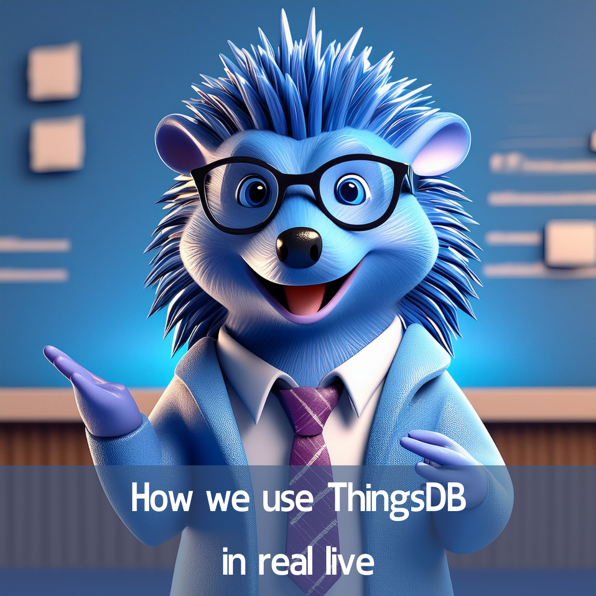

# ThingsDB in real live

ThingsDB is the backend of the monitoring platform InfraSonar and it has proven it’s worth several times over.

As Leonardo da Vinci said:Simplicity is the ultimate sophistication

So let’s dive in and find out why we are so full of ThingsDB and hopefully help you gain some understanding of its powers.

First let me explain what InfraSonar is.

InfraSonar is a monitoring solutions as a service developed by Cesbit that aims at delivering deep insight for it’s users while remaining easy to use and maintain.

InfraSonar collects data from infrastructure components such as routers, switches, servers, storage systems, Database servers, Microsoft Windows, Linux, etc. Data is sent directly to the API when InfraSonar agents are used or to the hub’s when data is retrieved agentless using our ready to run appliances.

All data is processed in our cloud backend where it is evaluated using our powerful conditions. Time-series data is stored in a SiriDB cluster and when applicable sent to the forecasting services.

As you can imagine we process a lot of dat

a in realtime so we can’t afford any downtime.

Hence we created ThingsDB

A three node ThingsDB cluster is at the heart of InfraSonar and is responsible for maintaining and storing our extensive configuration of assets, conditions and views. ThingsDB is also responsible for orchestrating the hub microservers ensuring they are correctly initialized and are updated the moment a configuration change happens. This is mainly possible due to our elaborate event handling capabilities that allows for a real time and reliable way of sending updates through the platform.

When we started InfraSonar we deployed a ThingsDB cluster and it has been up and running since. Any code updates we need to perform we are able to do without any downtime or hiccups.

Our development team loves ThingsDB as it removes a lot of the complexity that comes with building high available solutions. A phrase we often hear is: it just works.

To give a full overview of our backend:

* A 3 node ThingsDB cluster is at the heart of InfraSonar  
* 9 hubs handle all incoming monitoring data, on arrival data is stored over three nodes to ensure high availability.  
* 3 web servers serve our front-end.  
* A single node ThingsDB instance for sending email as a sort of micro-service  
* 6 node SiriDB cluster (3 pools) stores our time series data  
* 4 microservices keep our forecasts up to data in memory using data from 