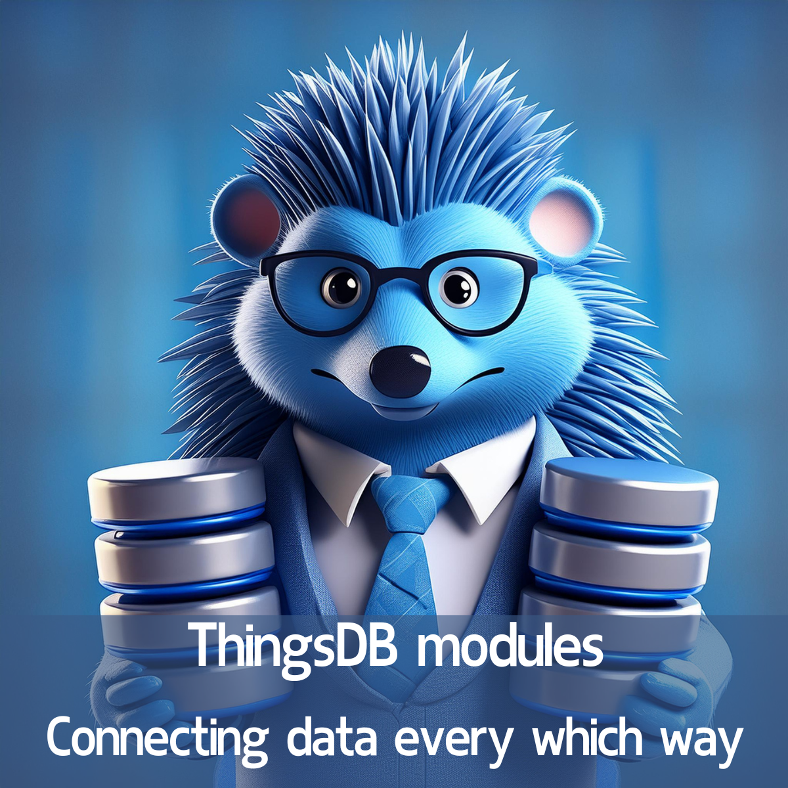

# ThingsDB modules

ThingsDB modules allow you to connect to any data platform. This enables full utilization of ThingsDB's features without the need for a total overhaul of your current data platform.
It also provides you the ability to make your data easily accessible using modern APIs and event-driven features.
We also support multiple modules to be deployed at once, allowing you the flexibility to combine datasets as if they were a single entity.