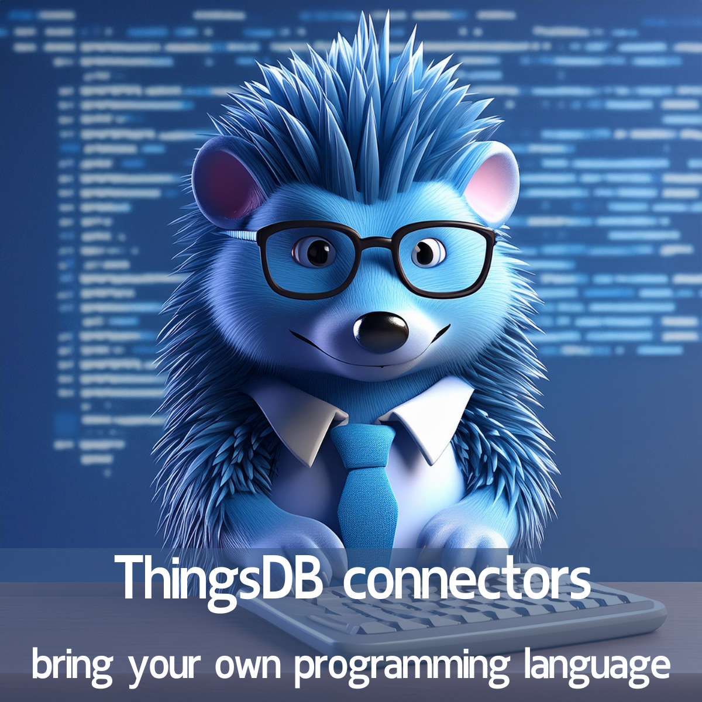

# Bridging Worlds: Unleashing the Power of ThingsDB with Connectors

ThingsDB is a versatile **Stored-State-Distributed-Interpreter (SSDI)** that combines the capabilities of a programming language and a database. While its core functionality is robust, the real magic happens when it integrates seamlessly with other systems and programming languages. This is where connectors come into play. Connectors are client libraries that enable you to interact with ThingsDB from your preferred programming languages, significantly expanding its reach and making it a versatile tool for any development stack. This blog post will delve into the benefits of using connectors to unlock the full potential of ThingsDB.

## Seamless Integration with Your Favorite Languages

One of the primary advantages of ThingsDB connectors is their ability to enable seamless integration with various programming languages. Instead of being confined to the ThingsDB language itself, you can leverage the power of ThingsDB from within your preferred development environment. ThingsDB offers connectors for:

- **Python:** A popular language for its simplicity and versatility, with a library called `python-thingsdb` available on [GitHub](https://github.com/thingsdb/python-thingsdb).
- **Go:** Known for its performance and efficiency, with our [go-thingsdb](https://github.com/thingsdb/go-thingsdb) connector.
- **C#:** Widely used for enterprise applications, with its own [connector}(https://github.com/thingsdb/ThingsDB-CSharp).
- **PHP:** A popular choice for web development, with a connector available.
- **JavaScript/Node.js:** Ideal for front-end and back-end development, with a dedicated connector.

This wide range of connectors means that you can integrate ThingsDB into your existing infrastructure without having to learn a completely new development paradigm. The provided examples in the sources, for example, demonstrate Python, but emphasize that they are easily adaptable to other languages.

## Direct Procedure Calls

Connectors provide a convenient way to call procedures directly, without having to invoke queries. While the ThingsDB Prompt is useful for running small code snippets, it does not support direct procedure calls. Connectors allow you to leverage the full potential of procedures, making it easier to interact with data managed by ThingsDB. This is especially useful in larger applications where you want to invoke procedures from multiple parts of the application. For example, you can use Python, C#, Go, PHP, or JavaScript/Node.js to invoke a procedure using the native client for the language.

## Simplifying Development Workflows

By integrating ThingsDB with your preferred programming languages, connectors significantly simplify your development workflow:
- **Code Reusability:** You can leverage existing code libraries and tools in your chosen language while interacting with ThingsDB.
- **Native Syntax:** You can interact with ThingsDB using familiar syntax and coding conventions, which reduces the learning curve.
- **Faster Development:** The use of well-established libraries can save development time.

## Enhancing Security and Maintainability

Connectors often include built-in security features such as authentication and authorization, ensuring your data is protected. When accessing ThingsDB, you can use either username and password authentication, or token based authentication which can be generated using the `new_token()` function and is often preferred.

The ThingsDB documentation provides detailed information on available connectors. You can find a list of all connectors at the official documentation website, making it easy to find the right connector for your project.

## Real-World Applications

Connectors enable ThingsDB to be used in a variety of practical scenarios:
- **Web Applications**: Connectors allow you to use ThingsDB as a backend data store for web applications written in PHP, JavaScript, or other languages.
*  **Microservices**: Connectors facilitate communication between microservices by allowing you to use the client in each microservice to interact with ThingsDB.
- **Event-Driven Systems:** ThingsDB's built-in pub/sub system can be utilized via connectors to create event-driven systems in languages like Python, JavaScript, or C#.
- **Data Processing**: The ThingsDB client allows you to use ThingsDB as a data store for data processing applications in Python, Go, or C#.

## Conclusion

Connectors are essential for any developer looking to fully harness the power of ThingsDB. They bridge the gap between ThingsDB's unique capabilities and the familiar landscapes of widely used programming languages. By enabling seamless interaction, direct procedure calls, and simplified workflows, connectors empower you to build more flexible and robust applications using ThingsDB. Whether you're using Python, Go, C#, PHP, or JavaScript, there's a ThingsDB connector ready to help you unlock the full potential of your data and development projects.
