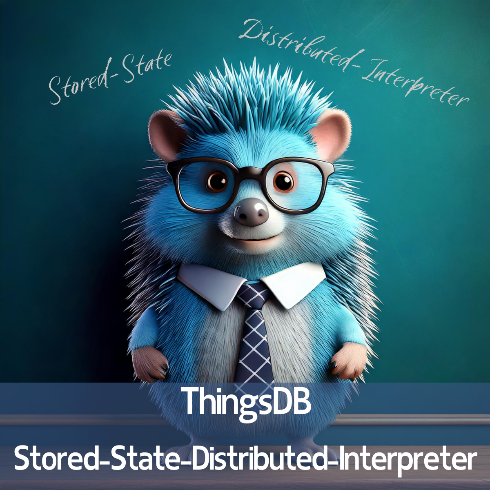

# Stored-State-Distributed-Interpreter

A Stored-State-Distributed-Interpreter (SSDI) is a type of system that combines the characteristics of a programming language interpreter with the data storage capabilities of a database, while also being designed to operate across multiple nodes. Here's a breakdown of what that means, drawing on the sources and our conversation history:

* **Stored-State:** Unlike traditional interpreters, like Python or Java, which lose their state when terminated, an SSDI maintains persistent state. This means that data and variables remain available even after the interpreter has been closed. In ThingsDB, for example, this is achieved by storing data within "things," which are objects with properties, in collections which act as containers.  
* **Distributed:** An SSDI is designed to run across multiple nodes, allowing for scalability and high availability. ThingsDB is built to operate on multiple nodes, synchronizing its state across all of them to ensure data integrity, even if some nodes fail. This distributed nature also enables capabilities like performing garbage collection without blocking.  
* **Interpreter:** Like other interpreted languages (such as Python) an SSDI does not need to be compiled before execution. Instead, it uses an interpreter that executes code directly. In ThingsDB, the interpreter is also responsible for executing code blocks, which can group statements.

In summary, a **Stored-State-Distributed-Interpreter** is a system that provides a programming environment with persistent data storage that can scale across multiple nodes. This unique combination allows for the creation of applications that are both flexible and robust. In the context of ThingsDB, this means developers can interact with data using a programming language that maintains its state, while also having the scalability and reliability of a distributed database.
