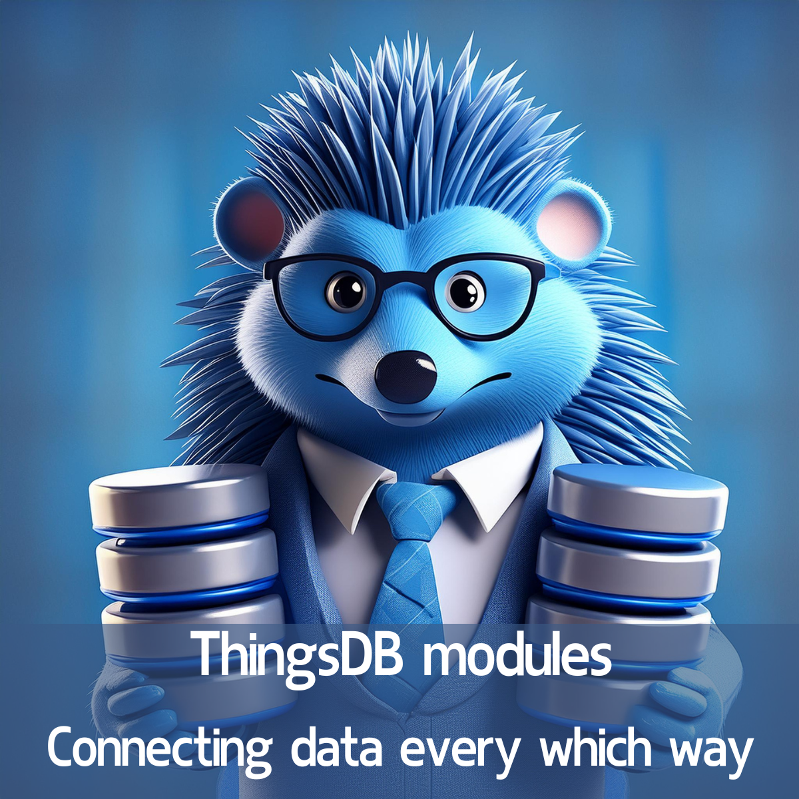

# Unleashing the Power of ThingsDB with Modules

ThingsDB is a powerful **Stored-State-Distributed-Interpreter (SSDI)** that combines the capabilities of a programming language with a database. While its core features are impressive on their own, ThingsDB's true potential is unlocked through its modularity. Modules in ThingsDB are like plugins that significantly expand its functionality, allowing it to interact with external resources, services, and platforms. This blog post will explore the numerous benefits of using modules within your ThingsDB projects.

## Extending Core Functionality

ThingsDB modules allow you to integrate a variety of features without having to build them from scratch. This saves development time and effort, allowing you to focus on the core logic of your applications. Modules can provide capabilities like:

- **[Sending emails](https://github.com/thingsdb/module-go-smtp)**
- **Interacting with external APIs**
- **Storing files in the cloud**
- **Connecting to other databases**
- **Making HTTP(S) requests**
- **Cross-scope communication within ThingsDB**

## Types of Modules

ThingsDB supports different types of modules, catering to a variety of needs:

- **Python Modules:** These offer a familiar language option for customization.
- **Binary Modules:** These are pre-written modules that provide various functionalities and are readily available for use. Writing custom binary modules in languages like Go is possible but is outside the scope of the provided sources.

## Easy Installation and Management

Modules in ThingsDB are designed to be easy to install and manage. The `new_module()` function, available in the `/thingsdb` scope, allows you to install modules by providing a module alias and the GitHub repository URL where the module resides. You can also specify a particular version of a module by adding `@v0.1.0` (or similar) to the URL.  

After installation, the `module_info()` function can be used to confirm that the module was successfully installed and to view the module's properties. The `refresh_module()` function can be used to update modules to the latest version, while `deploy_module()` allows you to pin a module to a specific version.

## Enhanced Performance

Modules in ThingsDB can significantly improve application performance in a few ways:

- Modules that fetch data from external sources can use the "mpdata" response format. This allows the data to be delivered directly to the client, avoiding unnecessary unpacking and repackaging steps, which can reduce processing overhead.
- By separating input from query structure, ThingsDB can cache the query, independent of the user input, improving the performance of frequently executed queries.

## Flexible Configuration

Modules can be configured to meet the specific needs of your application using `set_module_conf()`. Some modules may require authentication, which can be managed using tokens. You can also use the `set_module_scope()` function to limit a module's accessibility to a specific scope. If you need the same module with different configurations or access restrictions, you can install it multiple times with different names.

## Real-World Examples

The provided sources give some compelling real-world examples, such as:

- **NTFY Integration**: The HTTP(S) request module can be used to send messages to the NTFY app, demonstrating the ability to interact with external APIs.
- **Cross-Scope Communication**: The `thingsdb` module enables communication between different scopes within the same ThingsDB node or even across different ThingsDB clusters.
- **Demo Module**: The demo module's `echo` method returns a message that can be used to test the module and demonstrates how to retrieve a result from a module method.

## Error Handling

Modules include error handling through the `else()` method. This is particularly important when dealing with external systems, which can potentially fail due to network issues or other unforeseen circumstances. If both `else()` and `then()` are defined, only one will be called based on the outcome (success or error).

## Conclusion

Modules are a powerful tool in ThingsDB, enabling you to extend its core functionality with a diverse range of features and integrations. By using modules, you can build more complex, flexible, and robust applications that leverage the capabilities of ThingsDB. Whether it is integrating with external APIs, managing cross-scope communication, or sending notifications, modules unlock a new realm of possibilities for your ThingsDB projects.
